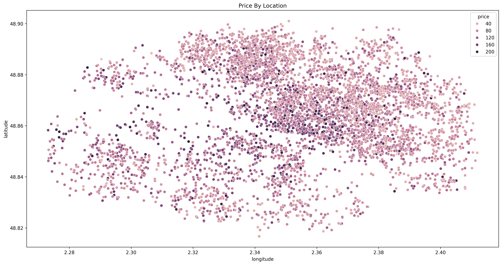
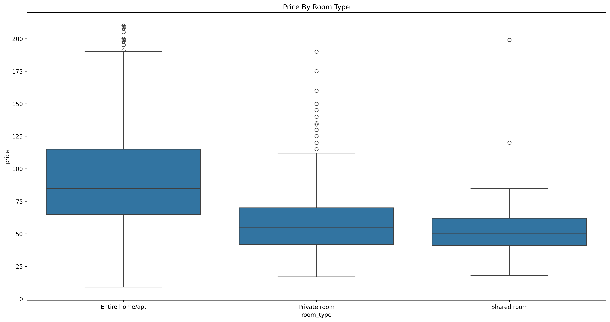
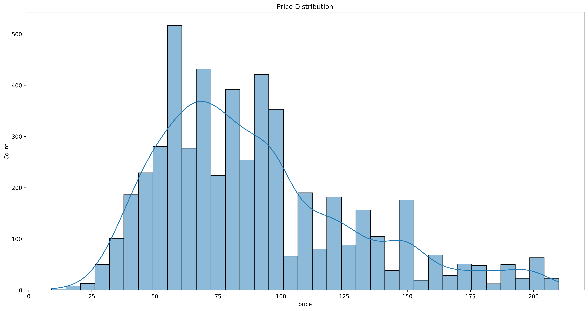
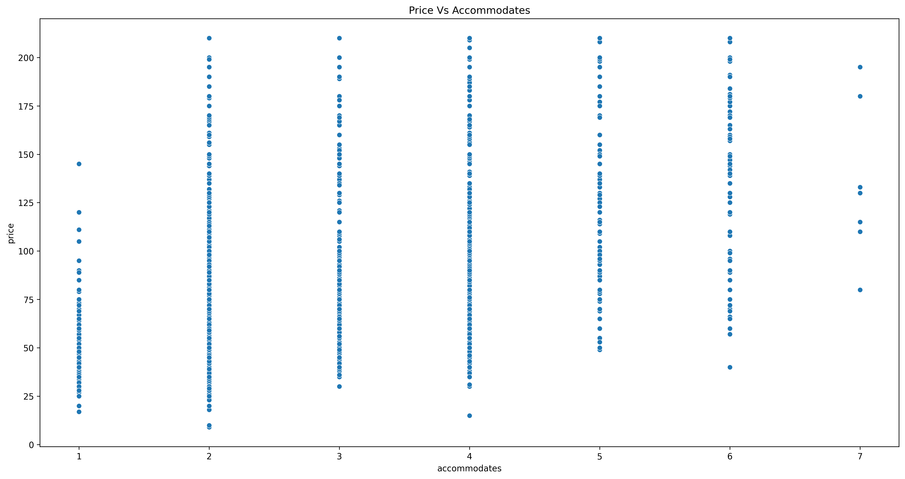

# Airbnb ML Project

## Commands
Requirement: https://pdm-project.org/en/latest/#installation
```bash
pdm install
```

Start client models:
```bash
pdm run start
```

Launch training models:
```bash
pdm run train
```

Evaluate models:
```bash
pdm run evaluate
```

## Data source
- https://insideairbnb.com/get-the-data/

## Visualization







## Best model

### T0 (initial version)
Best parameters for random_forest:
- {'max_depth': 10, 'min_samples_split': 50, 'n_estimators': 300}
- Best score: 0.634

Best parameters for gradient_boosting:
- {'learning_rate': 0.1, 'max_depth': 3, 'n_estimators': 100}
- Best score: 0.619

Best parameters for svr:
- {'C': 1, 'epsilon': 0.5, 'gamma': 0.1, 'kernel': 'rbf'}
- Best score: 0.625

Results:
- andom_forest
  - RMSE: 0.76
  - R2 Score: 0.39

- gradient_boosting
  - RMSE: 0.76
  - R2 Score: 0.39

- svr
  - RMSE: 0.76
  - R2 Score: 0.40

- linear_regression
  - RMSE: 0.78
  - R2 Score: 0.37

### T1 (first optimization)
Best parameters for random_forest:
- {'max_depth': 10, 'min_samples_split': 50, 'n_estimators': 200}
- Best score: 0.677

Best parameters for gradient_boosting:
- {'learning_rate': 0.05, 'max_depth': 3, 'n_estimators': 200}
- Best score: 0.674

Best parameters for svr:
- {'C': 1, 'epsilon': 0.5, 'gamma': 0.1, 'kernel': 'rbf'}
- Best score: 0.683

Results:
- random_forest
  - RMSE: 0.80
  - R2 Score: 0.34

- gradient_boosting
  - RMSE: 0.80
  - R2 Score: 0.34

- svr
  - RMSE: 0.80
  - R2 Score: 0.34

  linear_regression
  - RMSE: 0.87
  - R2 Score: 0.21
